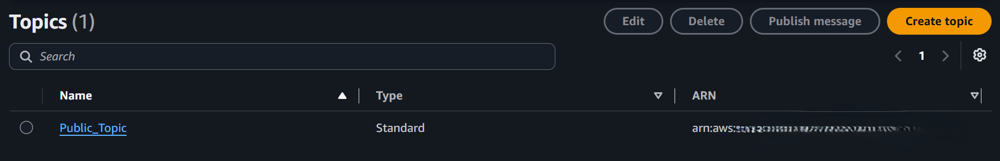
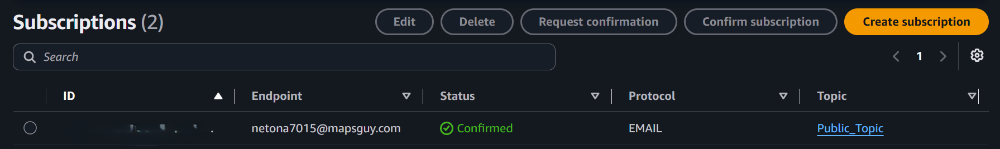
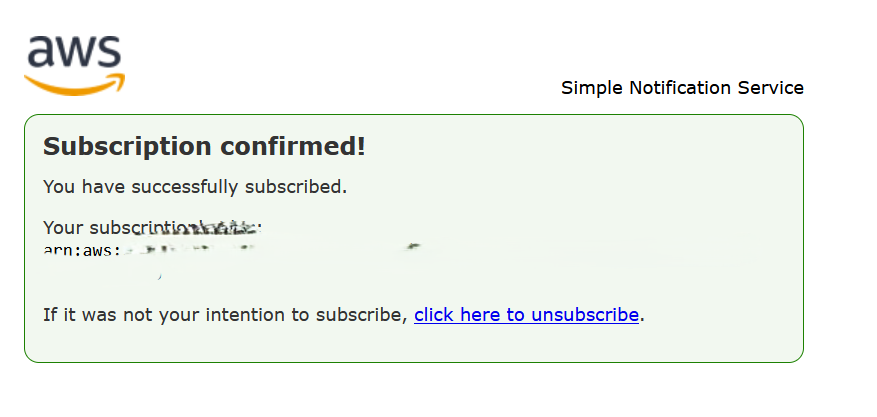
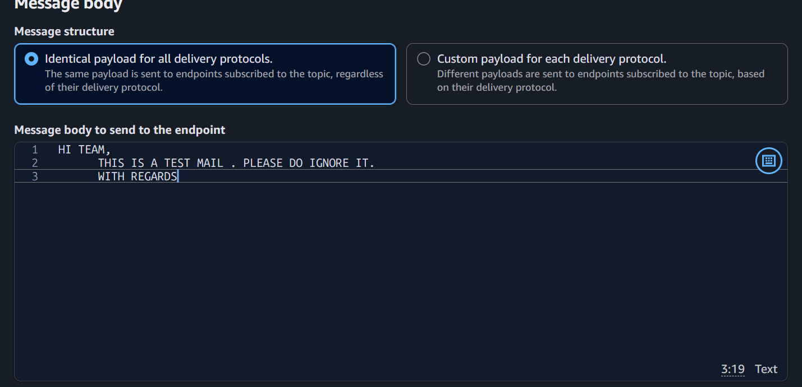
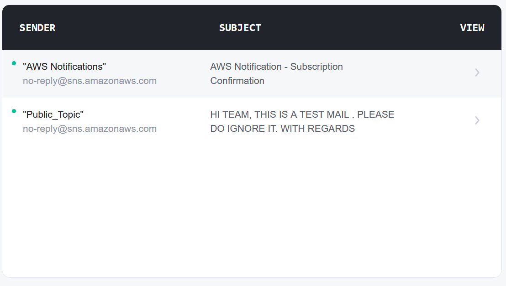

               AWS SNS Event-Driven Messaging & Notification Service

Project Overview
This project demonstrates how to set up an automated, event-driven notification architecture using Amazon Simple Notification Service (SNS). 

The primary objective is to build a publisher-subscriber (Pub/Sub) messaging model capable of fanning out notifications instantaneously to subscribed downstream endpoints. The implementation validates end-to-end messaging workflows, from topic configuration and subscription handshake to message dispatch and verified delivery.

Services Used
- Amazon SNS (Simple Notification Service)
- AWS Management Console
- Email Client (Subscriber Protocol)

Configuration Details
Parameter | Configuration
AWS Region | Europe (Ireland) eu-west-1
Topic Name | Public_Topic
Topic Type | Standard Topic
Topic ARN | arn:aws:sns:eu-west-1:096031499018:Public_Topic
Protocol | Email
Subscription ID | 9b5f6ac0-45b4-4d78-ad43-f8aea152730b
Endpoint Status | Confirmed

Step 1 - Create Amazon SNS Topic
Created a standard SNS topic named Public_Topic in the eu-west-1 region to act as the centralized message hub for dispatching alerts.

Step 2 - Configure Subscriber Endpoint
Created an email subscription pointing to Public_Topic:
- Selected EMAIL protocol.
- Directed delivery to the designated recipient endpoint.
- Monitored initial status transitioning to Pending Confirmation.

Step 3 - Validate Subscription Handshake
Completed the AWS opt-in verification protocol:
- Retrieved the automated confirmation email sent by no-reply@sns.amazonaws.com.
- Clicked the verification link to confirm the subscription ARN 9b5f6ac0-45b4-4d78-ad43-f8aea152730b.
- Verified in the AWS Console that subscription status switched to Confirmed.

Step 4 - Publish Notification Payload
Published a message directly from the AWS SNS console:
- Selected identical payload structure for delivery protocols.
- Dispatched formatted alert body: "HI TEAM, THIS IS A TEST MAIL . PLEASE DO IGNORE IT. WITH REGARDS".

Step 5 - Verify End-to-End Notification Delivery
Monitored the recipient email client to verify real-time event delivery:
- Confirmed immediate receipt of the published email notification from Public_Topic.
- Validated payload integrity, sender attributes, and transport latency.

Project Verification & Screenshots
Step 01 - Active Standard SNS Topic (Public_Topic):

Step 02 - Confirmed Subscription Console View:

Step 03 - AWS Subscription Confirmation Confirmation Page:

Step 04 - Message Publishing Payload:

Step 05 - Email Inbox Delivery Verification:

Testing & Verification
- Confirmed successful topic creation and ARN allocation in the eu-west-1 region.
- Verified two-way subscription authorization handshake preventing unverified spam delivery.
- Validated fanout delivery model by successfully dispatching messages to confirmed email endpoints.
- Confirmed raw message payload consistency between AWS SNS console output and client email inbox.

Learning Outcomes
- Configured Amazon SNS Topics and Subscriptions.
- Implemented Pub/Sub (Publish-Subscribe) design patterns for decoupled cloud architectures.
- Handled email subscription handshake procedures and security confirmations.
- Monitored message fanout pipelines and delivery mechanics.

Author

ADITYA MANIVANNAN

AWS Cloud | DevOps Engineer
